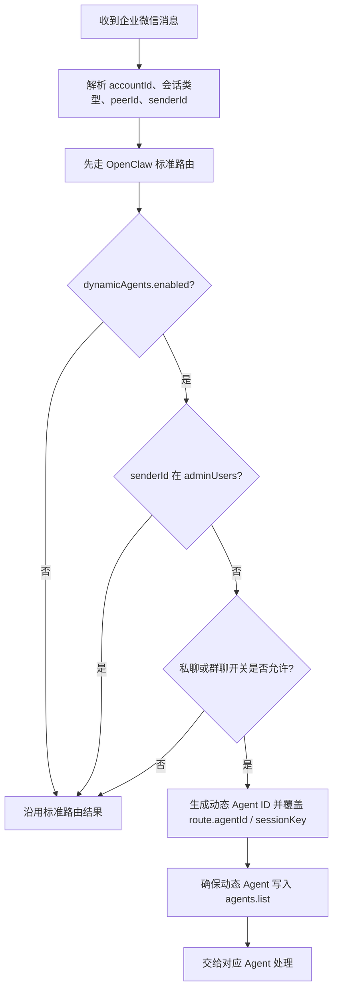

`dynamicAgents` 的核心价值，不是“自动创建很多 Agent”，而是让企业微信里的每个用户、每个群聊都拥有稳定、独立的会话落点。

如果不开它，所有消息更容易汇入同一个主 Agent。一旦开始多人共用同一个企业微信入口，最先出问题的通常不是模型能力，而是上下文、长期记忆、任务状态和处理边界混在一起。

## 它解决什么问题

企业微信里的真实使用场景往往很快从“一个人测试机器人”变成“很多人、很多群、很多业务线同时使用”。这时最怕的不是机器人慢一点，而是下面这些情况：

| 📍 场景 | ❌ 不开启时 | ✅ 开启后 |
|:---|:---|:---|
| 多个同事私聊同一个机器人 | 容易共用主 Agent 的上下文 | 每个人命中自己的动态 Agent |
| 多个群长期协作 | 群与群之间的问题、结论和记忆可能混在一起 | 每个群有独立会话空间 |
| 多账号矩阵 | 不同企业、部门、机器人更容易落到同一主会话 | 动态 ID 会带上 `accountId` |
| 管理员巡检 | 管理员也被切到自己的动态会话里，排障分散 | `adminUsers` 可绕过动态路由 |

一句话理解：`dynamicAgents` 管的是**会话落点**，让“谁在什么入口说话”尽量落到稳定且独立的 Agent。

## 推荐配置

生产环境最常见的配置如下：

```json
{
  "channels": {
    "wecom": {
      "dynamicAgents": {
        "enabled": true,
        "dmCreateAgent": true,
        "groupEnabled": true,
        "adminUsers": ["zhangsan001"]
      }
    }
  }
}
```

字段说明：

| ⚙️ 字段 | 📋 默认值 | 📝 说明 |
|:---|:---|:---|
| `enabled` | `false` | 总开关。不开时，后面的私聊和群聊开关都不会生效 |
| `dmCreateAgent` | `true` | 私聊是否进入动态 Agent 隔离 |
| `groupEnabled` | `true` | 群聊是否进入动态 Agent 隔离 |
| `adminUsers` | `[]` | 管理员 userId 列表，命中后绕过动态路由，继续使用主 Agent |

默认值的含义很重要：插件默认没有强行开启动态路由；但一旦你把 `enabled` 设为 `true`，私聊和群聊默认都会进入隔离模式。

## 什么时候应该开启

| 🚀 使用阶段 | 💡 建议 | ❓ 原因 |
|:---|:---|:---|
| 单人 PoC | 可以先不开 | 先确认凭证、网络、消息收发是否正常 |
| 小团队试用 | 建议开启私聊隔离 | 减少几个人共用时的上下文串线 |
| 群聊长期使用 | 建议开启群聊隔离 | 每个群通常代表一个项目、部门或业务现场 |
| 生产环境 | 建议开启 | 多人、多群、多账号是常态 |
| 排障期 | 给管理员配置 `adminUsers` | 管理员可以直接看主 Agent 行为 |

推荐路径是：先用 Bot WS 跑通基础收发，再开启 `dynamicAgents`，最后补 Agent、媒体目录和上下游企业配置。

## 动态 Agent ID 如何生成

插件会按下面三部分生成确定性的 Agent ID：

```text
wecom-{accountId}-{chatType}-{peerId}
```

其中：

| 🧩 组成 | 📖 含义 | 💡 示例 |
|:---|:---|:---|
| `accountId` | WeCom 账号 ID | `default`、`sales`、`ops` |
| `chatType` | 会话类型 | `dm` 或 `group` |
| `peerId` | 对端 ID | 私聊 userId 或群聊 roomId |

示例：

```text
wecom-default-dm-zhangsan
wecom-default-group-wr123456
wecom-sales-dm-lisi
```

代码里会对 ID 做安全处理：去掉首尾空格、转小写，并把不适合出现在 ID 里的字符替换成 `_`。这样同一个用户或同一个群下一次发消息时，会继续命中同一个动态 Agent，而不是临时随机分配。

## 运行时实际流程



关键点：

- 插件会先调用 OpenClaw 的标准渠道路由，得到基础 route。
- 如果当前消息应该使用动态 Agent，就用动态 Agent ID 覆盖 `route.agentId`。
- 同时生成更细的 `sessionKey`，格式类似 `agent:{dynamicAgentId}:wecom:{accountId}:{chatType}:{peerId}`。
- 首次命中某个动态 Agent 时，插件会尝试把它追加到 `agents.list`，避免你手工维护大量用户或群聊条目。
- 这套逻辑同时作用于 `Bot WS` 和 `Agent Callback` 主消息链路，不是只有某一种模式才生效。

## 和 Bot WS、Agent 的关系

`dynamicAgents` 不属于 Bot WS，也不属于 Agent。它位于消息进入 OpenClaw 之后的路由层。

| 🔌 通道 | 🔄 是否受影响 | 📝 说明 |
|:---|:---|:---|
| Bot WS | 是 | v2.3.19 后，Bot WS 也会走同样的动态路由 |
| Bot Webhook | 是 | 只要消息进入统一运行时，就会按同一套规则判断 |
| Agent Callback | 是 | 自建应用回调事件和消息也会按会话维度路由 |
| Agent 主动发送 | 间接受影响 | 回复落点由入站会话路由决定，主动广播本身仍看投递目标 |

因此，双通道生产形态下，它的价值尤其明显：用户从 Bot WS 进入、从 Agent Callback 进入，都能保持同一套隔离逻辑。

## 和多账号矩阵的关系

多账号矩阵负责“这个消息属于哪个企业微信账号”，`dynamicAgents` 负责“这个账号下的哪个用户或群聊应该落到哪个 Agent”。

动态 ID 会带上 `accountId`，所以同一个 userId 在不同账号下不会天然混在一起：

```text
wecom-sales-dm-zhangsan
wecom-ops-dm-zhangsan
```

这对企业矩阵很关键。否则不同企业、部门或业务机器人如果碰巧有相同 userId，就可能在上下文层面发生交叉。

## 和上下游企业的关系

`dynamicAgents` 和上下游企业是平级能力，解决的问题不同：

| ⚡ 能力 | 🎯 解决的问题 | 🔧 典型配置 |
|:---|:---|:---|
| `dynamicAgents` | 消息进入 OpenClaw 后落到哪个会话 Agent | `channels.wecom.dynamicAgents` |
| 上下游企业 | 回复或主动投递时用哪个企业身份发出去 | `accounts.<id>.agent.upstreamCorps` |

可以这样理解：

- `dynamicAgents` 关心“张三这次对话应该由哪个 Agent 处理”。
- 上下游企业关心“给下游企业用户回消息时，应该使用哪个 CorpID / AgentID / access_token”。

两者可以同时开启。比如下游企业的某个用户从共享应用进入后，入站阶段先由 `dynamicAgents` 分配稳定会话，出站阶段再由 `upstreamCorps` 选择正确的下游企业投递身份。

## 和权限策略的边界

`dynamicAgents` 解决的是“路由隔离”和“会话隔离”，不是权限系统本身。

它不能替代这些配置：

| 🔒 你要控制的事 | 👀 应该看哪里 |
|:---|:---|
| 是否允许某人私聊机器人 | `bot.dm.policy` 或 `agent.dm.policy` |
| 哪些 userId 可以访问 | `dm.allowFrom` |
| 企业微信应用对谁可见 | 企业微信后台应用可见范围 |
| 菜单事件是否允许进入 AI 流程 | `agent.inboundPolicy` 与 `agent.eventRouting` |
| 下游企业是否能收到消息 | `agent.upstreamCorps` 与应用共享配置 |

也就是说，`dynamicAgents` 能显著减少上下文串线，但“谁能用、谁能触发、能发给谁”仍要结合权限、绑定和企业微信后台授权一起看。

## 常见配置方案

### 只隔离私聊

适合群聊只做简单广播，但私聊需要个人上下文的场景：

```json
{
  "channels": {
    "wecom": {
      "dynamicAgents": {
        "enabled": true,
        "dmCreateAgent": true,
        "groupEnabled": false
      }
    }
  }
}
```

### 私聊和群聊都隔离

适合生产环境默认选择：

```json
{
  "channels": {
    "wecom": {
      "dynamicAgents": {
        "enabled": true,
        "dmCreateAgent": true,
        "groupEnabled": true
      }
    }
  }
}
```

### 管理员绕过动态路由

适合运维、运营或开发者排查主 Agent 行为：

```json
{
  "channels": {
    "wecom": {
      "dynamicAgents": {
        "enabled": true,
        "adminUsers": ["admin001", "ops001"]
      }
    }
  }
}
```

命中 `adminUsers` 的用户不会进入自己的动态 Agent，而是沿用 OpenClaw 标准路由结果。

配置效果示例：


## 如何确认已经生效

开启后，先发送一条私聊消息，再查看状态和日志：

```bash
openclaw channels status --probe
openclaw channels logs --channel wecom --lines 200
```

你可以重点关注：

- 消息是否命中了预期账号。
- 日志里是否出现类似 `wecom-default-dm-xxx` 或 `wecom-default-group-xxx` 的 Agent ID。
- OpenClaw 配置中的 `agents.list` 是否被追加了对应动态 Agent。
- 同一个用户再次发送消息时，是否继续命中同一个动态 Agent。

如果没有看到动态 Agent，按下面顺序检查：

1. `channels.wecom.dynamicAgents.enabled` 是否为 `true`。
2. 私聊场景下 `dmCreateAgent` 是否不是 `false`。
3. 群聊场景下 `groupEnabled` 是否不是 `false`。
4. 当前发送者是否在 `adminUsers` 中。
5. 消息是否真的进入 WeCom 统一运行时。

## 常见问题

### 开启后为什么管理员没有进入动态 Agent？

这是预期行为。`adminUsers` 中的账号会绕过动态路由，继续使用标准路由结果。这个设计是为了让管理员、运维或测试账号能直接巡检主 Agent。

### 会不会为每条消息创建一个新 Agent？

不会。动态 Agent ID 是确定性的。同一个账号、同一种会话类型、同一个 peerId 会生成同一个 ID。

### 会不会把所有配置文件写得很大？

首次命中一个新的动态 Agent 时，插件会尝试把它追加到 `agents.list`。如果你的企业微信入口服务大量用户或群聊，列表会增长。生产环境建议定期观察实际规模，并结合 OpenClaw 的 Agent 管理策略做清理或归档。

### dynamicAgents 能解决用户权限问题吗？

不能。它只决定会话落点，不决定用户有没有权限使用机器人。权限仍然要看 `dm.policy`、`allowFrom`、企业微信应用可见范围和相关业务策略。

### 为什么 Bot WS 和 Agent Callback 的上下文现在一致了？

因为当前实现里，消息进入统一运行时后都会经过同一套动态路由判断。v2.3.19 之后，Bot WS 也真正走 `dynamicAgents`，避免 WebSocket 链路重新落回主 Agent。

## 推荐阅读

- [配置说明](../configuration/configuration)
- [上下游企业](../upstream/upstream)
- [排障指南](../operation/troubleshooting)
