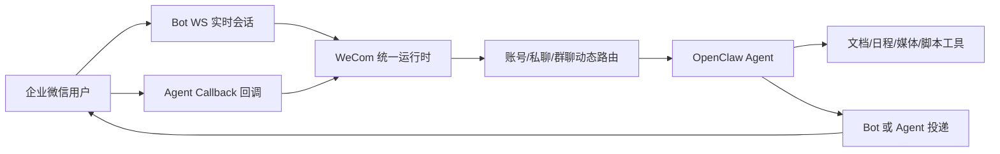

<section class="hero">
  
OpenClaw Channel Plugin

  <h1>WeCom 企业微信帮助文档</h1>
  

    把企业微信接成一个可长期运行、可治理、可扩展的 AI 协作入口。支持 Bot WebSocket 与自建应用 Agent 双模式，覆盖快速试用、生产部署、多账号隔离、上下游企业、菜单事件与媒体投递等场景。
  

  

    <a class="button button-primary" href="{{ site.baseurl }}/quick-start/quick-start.html">快速开始</a>
    <a class="button button-secondary" href="{{ site.baseurl }}/configuration/configuration.html">查看配置</a>
    <a class="button button-secondary" href="{{ site.baseurl }}/operation/troubleshooting.html">排障指南</a>
  

</section>

  <strong>建议阅读顺序：</strong> 先用 Bot WS 跑通收发，再按生产需求补齐 Agent、动态路由、媒体目录和上下游企业配置。这样可以先得到可用体验，再逐步加上企业级治理能力。

<<<<<<< HEAD
## 这个插件解决什么问题
=======

  <strong>⚠️ 原创声明</strong>
  
本项目涉及的「多账号隔离与矩阵路由架构」、「Bot+Agent 双模融合架构」、「长任务超时接力逻辑」及「全自动媒体流转接」等核心设计均为作者 <strong>YanHaidao</strong> 独立思考与实践的原创成果。

  
欢迎技术交流与合规引用，但严禁任何不经授权的「功能像素级抄袭」或删除原作者署名的代码搬运行为。

## 💡 这个插件解决什么问题
>>>>>>> 72e90f3 (feat：将原创说明移至首页)

企业真正需要的通常不是“把模型接进企业微信”，而是让企业微信成为一个稳定的 AI 工作入口：多人同时使用不串上下文，长任务不会因为响应窗口过短而丢失结果，日常聊天和正式投递可以走各自更合适的链路。

  

    01
    <h3>上下文隔离</h3>
    
按账号、私聊、群聊、用户或会话维度动态切分运行上下文，减少多人共用入口时的会话串线。

  

  

    02
    <h3>Bot + Agent 双通道</h3>
    
Bot WS 负责低门槛、实时、流式体验；Agent 负责正式回调、主动通知、组织级能力和兜底投递。

  

  

    03
    <h3>长任务接力</h3>
    
面对长推理、长文本分析或媒体处理任务，插件会尽量保持会话反馈，并在必要时切换投递路径。

  

  

    04
    <h3>企业协作能力</h3>
    
文档、日程、会议、待办、通讯录等能力可以作为工具层接入，让 AI 不只停留在聊天框。

  

## 选择 Bot WS 还是 Agent

| 你关心的事 | Bot WS | Agent 自建应用 | 推荐做法 |
|:---|:---|:---|:---|
| 快速跑通 | 配置轻，无需固定公网回调地址 | 需要自建应用、回调地址、Token 与 AES Key | 先用 Bot WS 验证体验 |
| 实时对话 | 更适合低延迟、流式、会话内追发 | 能收发，但体验更偏正式回调 | 日常聊天优先 Bot WS |
| 主动通知 | 受会话边界影响 | 更适合组织级投递、冷启动触达 | 通知与广播走 Agent |
| 生产治理 | 适合轻量接入 | 权限、回调、安全边界更完整 | 生产环境建议补 Agent |
| 企业协作工具 | 可承载个人身份能力入口 | 可承载应用身份能力入口 | 两者并存时能力最完整 |

从用户视角看，差别不在于协议名词，而在于**你要解决的是什么问题**。

| 你真正关心的事 | 🤖 Bot 模式 (WebSocket) | 🧩 Agent 模式 (自建应用 API) | ✨ 本插件的做法 |
|:---|:---|:---|:---|
| **先跑起来的速度** | ✅ 快，无需固定公网 IP | ❌ 较重，需要正式应用配置 | ✅ 先用 Bot 起步，后续平滑补 Agent |
| **实时聊天体验** | ✅ 最强，天然适合低延迟和流式回复 | ⚠️ 能收能发，但不是最佳对话入口 | ✅ 默认把实时交互交给 Bot |
| **异步结果回推** | ✅ 可以，适合已建立会话内追发 | ✅ 可以 | ✅ 会话内追发优先 Bot，必要时 Agent 兜底 |
| **组织级广播与冷启动触达** | ⚠️ 受会话边界约束 | ✅ 更适合 | ✅ 正式通知和广播走 Agent |
| **企业微信协作能力** | ✅ 适合个人身份能力入口 | ✅ 适合应用身份能力入口 | ✅ 两种身份平面都兼容 |
| **适合谁** | 想快速上线、重视实时体验的团队 | 需要正式治理、自动化和组织级能力的团队 | 想同时要"体验"和"能力"的团队 |

  

    <h3>适合先上 Bot WS 的团队</h3>
    <ul>
      <li>希望先在企业微信里把 AI 聊起来。</li>
      <li>暂时没有公网回调地址或正式应用治理流程。</li>
      <li>更关注实时对话、流式回复、轻量试用。</li>
    </ul>
  

  

    <h3>适合补齐 Agent 的团队</h3>
    <ul>
      <li>需要菜单事件、回调验签、正式应用权限。</li>
      <li>需要主动给用户、部门、标签或上下游企业发消息。</li>
      <li>准备把插件作为生产级入口长期运行。</li>
    </ul>
  

## 从哪里开始

  <a class="path-item" href="{{ site.baseurl }}/quick-start/quick-start.html">
    路径 A
    <strong>5 分钟跑通 Bot WS</strong>
    <small>安装插件、填写 Bot ID 与 Secret、验证连接状态。</small>
  </a>
  <a class="path-item" href="{{ site.baseurl }}/configuration/configuration.html">
    路径 B
    <strong>整理生产配置</strong>
    <small>账号矩阵、Bot、Agent、媒体目录、动态 Agent、上下游企业。</small>
  </a>
  <a class="path-item" href="{{ site.baseurl }}/operation/deploy.html">
    路径 C
    <strong>部署与发布</strong>
    <small>环境要求、回调地址、启动方式、状态检查和升级策略。</small>
  </a>
  <a class="path-item" href="{{ site.baseurl }}/operation/troubleshooting.html">
    路径 D
    <strong>按症状排障</strong>
    <small>连接失败、消息不回、媒体发送失败、上下游投递异常。</small>
  </a>

## 文档地图

| 模块 | 适合阅读的人 | 你会得到什么 |
|:---|:---|:---|
| [快速开始]({{ site.baseurl }}/quick-start/quick-start.html) | 第一次接入的使用者 | 最小可用配置、向导接入、状态验证、第一轮测试 |
| [配置说明]({{ site.baseurl }}/configuration/configuration.html) | 准备生产化的维护者 | 完整配置结构、字段解释、账号隔离、动态 Agent、媒体目录 |
| [动态 Agent]({{ site.baseurl }}/dynamic-agents/dynamic-agents.html) | 多人、多群、多账号场景的维护者 | `dynamicAgents` 的配置、路由规则、会话隔离和排障方法 |
| [上下游企业]({{ site.baseurl }}/upstream/upstream.html) | 有上下游企业协作需求的团队 | 下游企业识别、`upstreamCorps` 映射、投递链路说明 |
| [菜单事件]({{ site.baseurl }}/functionality/menu-event.html) | 需要按钮、扫码、位置事件的开发者 | 事件白名单、路由条件、脚本处理、是否继续交给 AI |
| [部署运维]({{ site.baseurl }}/operation/deploy.html) | 负责上线和运行的人 | 生产环境建议、回调挂载、启动命令、升级和备份 |
| [排障指南]({{ site.baseurl }}/operation/troubleshooting.html) | 遇到异常时的排查者 | 按状态字段和日志命名空间定位问题 |
| [Release Notes]({{ site.baseurl }}/release-notes/release-notes.html) | 关注版本迭代的用户 | 各版本新增能力、重要修复与升级建议 |
| [关于项目]({{ site.baseurl }}/about/) | 想了解项目背景的人 | 原创声明、贡献者名单、开发指南 |

## 📌 最近更新

  

    v2.4.12
    

      <strong>菜单事件路由 · 上下游互通 · Webhook 修复</strong>
      
自建应用菜单事件可按规则路由到本地脚本，上下游企业可通过 Agent 渠道互通，Webhook 入站文件不再被固定 5MB 限制误拦。

    

  

  

    v2.3.27
    

      <strong>Guided Setup 回归 · SDK 兼容修复</strong>
      
<code>openclaw channels add</code> 重新支持 WeCom 交互式向导，修复 <code>installedCatalogById is not defined</code> 错误，清理 OpenClaw 新版下失效的旧 SDK 入口。

    

  

  

    v2.3.26
    

      <strong>消息不串 · 发图收尾 · 占位符修复</strong>
      
升级 OpenClaw 后不再乱报错，Agent 与 Bot WS 消息链路互不串扰，Bot WS 发图后不再多冒完成提示，占位符及时结束不刷屏。

    

  

  查看更早期的完整更新记录（含 v2.3.19、v2.3.18 等版本），请移步 <a href="{{ site.baseurl }}/release-notes/">Release Notes</a>。

## 推荐生产形态

生产环境最稳妥的思路是：Bot WS 负责“用户正在等回复”的实时链路，Agent 负责“需要企业应用身份保证”的正式链路。两者共享统一运行时和路由策略，避免同一个用户在不同入口下出现行为割裂。

## 发布前检查清单

- 已确认 `channels.wecom.enabled=true`，并设置 `defaultAccount`。
- 每个账号都设置了清晰的 `enabled`、`name`、`bot` 或 `agent` 配置。
- Bot WS 已通过 `openclaw channels status --probe` 看到 `connected=true` 与 `authenticated=true`。
- Agent 模式已在企业微信后台配置正确的回调 URL、Token 和 EncodingAESKey。
- 生产环境已使用环境变量或密钥管理方案保存 Secret。
- 涉及本地文件发送时，已配置必要的 `media.localRoots`，且没有放开过大的目录。
- 多人、群聊或多账号场景已评估是否开启 `dynamicAgents`。
- 上下游企业场景已配置 `agent.upstreamCorps` 并完成企业微信后台应用共享。

---

## 🤝 项目协作者

感谢所有为本项目提交代码、测试、文档与反馈的协作者。

  

如果头像墙没有立刻刷新，通常是 GitHub 统计或第三方缓存延迟，稍后再看即可。

---

## 📝 更新日志

查看更早期关于「超时熔断代投、动态扩容矩阵」等功能的更新记录，请移步 [changelog]({{ site.baseurl }}/changelog/)。

